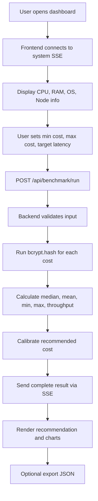

<div align="center">

# Bcrypt-Guard Adaptive Calibrator

**Benchmark bcrypt บนฮาร์ดแวร์จริง เพื่อแนะนำค่า Cost ที่สมดุลระหว่าง Security, Latency และ Throughput**


</div>

---

## Project Snapshot

| รายการ | รายละเอียด |
|---|---|
| ชื่อโปรเจกต์ | `Bcrypt-Guard Adaptive Calibrator` |
| จุดประสงค์ | วัดประสิทธิภาพ bcrypt และแนะนำค่า Cost ที่เหมาะกับเครื่องจริง |
| Backend | Node.js, Express.js, bcrypt |
| Frontend | HTML, CSS, Vanilla JavaScript, Chart.js |
| Deployment | Docker, docker-compose |
| Real-time | Server-Sent Events (SSE) |
| ค่าเริ่มต้น | Cost `4-14`, Samples `5`, Target latency `250ms` |
| Security floor | บังคับค่าแนะนำไม่ต่ำกว่า `cost 10` |
| Port | `4000` |

> **แนวคิดหลัก:** ค่า bcrypt cost ไม่ควรเดาจากตัวเลขกลาง ๆ เพียงอย่างเดียว เพราะ CPU แต่ละเครื่องแรงไม่เท่ากัน โปรเจกต์นี้จึงวัดจากเครื่องจริง แล้วค่อยแนะนำค่าที่เหมาะสม

---

## Table of Contents

- [Why This Project Exists](#why-this-project-exists)
- [Key Features](#key-features)
- [How bcrypt Cost Works](#how-bcrypt-cost-works)
- [How The System Works](#how-the-system-works)
- [Architecture](#architecture)
- [Project Structure](#project-structure)
- [Quick Start](#quick-start)
- [Configuration](#configuration)
- [API Reference](#api-reference)
- [Recommendation Algorithm](#recommendation-algorithm)
- [DoS Risk Assessment](#dos-risk-assessment)
- [Offline Runtime Support](#offline-runtime-support)
- [Docker And Security Hardening](#docker-and-security-hardening)
- [Limitations](#limitations)
- [Troubleshooting](#troubleshooting)
- [Future Improvements](#future-improvements)

---

## Why This Project Exists

การตั้งค่า bcrypt cost เป็นการแลกเปลี่ยนระหว่าง **ความปลอดภัย** และ **ประสิทธิภาพ**

### ถ้าตั้ง Cost ต่ำเกินไป

- Hash ถูก brute force ได้ง่ายขึ้น
- ไม่ใช้ศักยภาพของ CPU ให้คุ้มค่า
- อาจต่ำกว่าแนวทางความปลอดภัยที่ควรใช้ในระบบจริง

### ถ้าตั้ง Cost สูงเกินไป

- Login ช้าจนกระทบประสบการณ์ผู้ใช้
- Server รองรับ request login พร้อมกันได้น้อยลง
- เสี่ยงถูกโจมตีแบบ Denial of Service เพราะแต่ละ login ใช้ CPU สูง

**Bcrypt-Guard** จึงใช้วิธี benchmark บน hardware จริง แล้วคำนวณค่า cost ที่เหมาะสมตาม latency เป้าหมายและ minimum security floor

---

## Key Features

| Feature | รายละเอียด |
|---|---|
| System Detection | ตรวจ CPU, RAM, OS, Node version และจำนวน core อัตโนมัติ |
| Real-time Monitoring | แสดง CPU/RAM usage แบบ real-time ผ่าน SSE |
| bcrypt Benchmark | ทดสอบ bcrypt hash จริงตามช่วง cost ที่กำหนด |
| Live Progress | ส่ง progress ระหว่าง benchmark ผ่าน Server-Sent Events |
| Smart Calibration | แนะนำ cost จาก median latency, target latency และ OWASP floor |
| DoS Risk Label | ประเมินความเสี่ยงจาก throughput ของ cost ที่แนะนำ |
| Charts | แสดงกราฟ Latency vs Cost และ Throughput vs Cost |
| Export JSON | ดาวน์โหลดผล benchmark ล่าสุดเป็น JSON |
| Theme Toggle | รองรับ Light/Dark theme |
| Offline Runtime | หน้าเว็บไม่โหลด frontend library จาก CDN ตอน runtime |
| Docker Ready | รันง่ายด้วย Dockerfile และ docker-compose |

---

## How bcrypt Cost Works

bcrypt ใช้ค่า cost เพื่อกำหนดจำนวนรอบการทำงานของอัลกอริทึม โดยจำนวนรอบเพิ่มแบบ exponential ตามสูตร:

```text
iterations = 2^cost
```

ตัวอย่าง:

| Cost | Iterations | ความหมาย |
|---:|---:|---|
| 10 | 1,024 | baseline ที่ระบบใช้เป็น minimum floor |
| 11 | 2,048 | workload เพิ่มประมาณ 2 เท่าจาก cost 10 |
| 12 | 4,096 | workload เพิ่มประมาณ 4 เท่าจาก cost 10 |
| 13 | 8,192 | workload เพิ่มประมาณ 8 เท่าจาก cost 10 |

เมื่อ cost เพิ่มขึ้น 1 ระดับ งานของ CPU จะเพิ่มขึ้นโดยประมาณ 2 เท่า ทำให้ latency เพิ่มขึ้นตามไปด้วย

> เพราะ hardware แต่ละเครื่องไม่เท่ากัน การ benchmark จากเครื่องจริงจึงแม่นกว่าการเดาจากสูตรอย่างเดียว

---

## How The System Works



ระหว่าง benchmark ระบบจะส่ง event กลับไปยัง frontend เช่น `start`, `progress`, `result`, `complete`, `error` และ `cancelled`

---

## Architecture

```text
Browser Dashboard
  |
  | HTTP + Server-Sent Events
  v
Express.js API Server
  |
  | bcrypt.hash(password, cost)
  v
CPU-bound bcrypt Benchmark
  |
  v
Statistics + Calibration + JSON Export
```

### Frontend

อยู่ใน `public/` ทำหน้าที่แสดง dashboard, controls, progress, recommendation และ charts

### Backend

อยู่ใน `src/server.js` ทำหน้าที่เป็น API server, benchmark engine, system monitor และ calibration engine

### Container Runtime

ใช้ `Dockerfile` และ `docker-compose.yml` เพื่อให้รันง่ายและสภาพแวดล้อมสม่ำเสมอ

---

## Project Structure

```text
.
├── Dockerfile
├── docker-compose.yml
├── package.json
├── package-lock.json
├── README.md
├── .env
├── .dockerignore
├── .gitignore
├── src/
│   └── server.js
└── public/
    ├── index.html
    ├── styles.css
    ├── app.js
    └── chart.min.js
```

| Path | Description |
|---|---|
| `src/server.js` | Express API, SSE streams, benchmark engine, calibration logic |
| `public/index.html` | Dashboard markup |
| `public/styles.css` | Layout, theme, responsive styling |
| `public/app.js` | Frontend logic, API calls, SSE listener, Chart.js rendering |
| `public/chart.min.js` | Local Chart.js bundle for offline runtime |
| `Dockerfile` | Multi-stage Node.js image build |
| `docker-compose.yml` | Service, port, env และ restart policy |
| `.env` | Runtime configuration |

---

## Quick Start

### Option 1: Run With Docker

```bash
docker-compose up --build -d
```

หรือถ้าเครื่องรองรับ Docker Compose v2:

```bash
docker compose up --build -d
```

เปิดเว็บ:

```text
http://localhost:4000
```

ดู logs:

```bash
docker-compose logs -f calibrator
```

หยุดระบบ:

```bash
docker-compose down
```

### Option 2: Run Locally With Node.js

```bash
npm install
npm start
```

Development mode:

```bash
npm run dev
```

---

## Configuration

ค่าเริ่มต้นอยู่ใน `.env`

```env
PORT=4000
BENCHMARK_MIN_COST=4
BENCHMARK_MAX_COST=14
BENCHMARK_SAMPLES=5
TARGET_LATENCY_MS=250
```

| Variable | Default | Description |
|---|---:|---|
| `PORT` | `4000` | Port ของ web server |
| `BENCHMARK_MIN_COST` | `4` | Cost ต่ำสุดที่จะ benchmark |
| `BENCHMARK_MAX_COST` | `14` | Cost สูงสุดที่จะ benchmark |
| `BENCHMARK_SAMPLES` | `5` | จำนวนครั้งที่ hash ต่อ cost |
| `TARGET_LATENCY_MS` | `250` | Latency เป้าหมายต่อ hash 1 ครั้ง |

Validation สำคัญ:

- Cost range ต้องอยู่ในช่วง `4-20`
- Cost range ต้องครอบคลุม `cost 10`
- Target latency ต้องอยู่ในช่วง `50-2000 ms`

---

## API Reference

### `GET /api/system-info`

คืนข้อมูล hardware และ runtime ของเครื่องที่รัน server

```json
{
  "hostname": "server-name",
  "platform": "win32",
  "arch": "x64",
  "release": "10.0.22631",
  "uptime": 12345,
  "cpu": {
    "model": "Intel(R) Core(TM)",
    "speed": 2688,
    "cores": 16,
    "physicalCores": 8,
    "usagePercent": 12.5
  },
  "memory": {
    "total": 16800000000,
    "free": 8000000000,
    "used": 8800000000,
    "usagePercent": "52.4"
  },
  "node": "v20.x.x",
  "bcryptNative": true
}
```

### `GET /api/system/stream`

SSE stream สำหรับข้อมูลระบบแบบ real-time ส่งข้อมูลทุก 1 วินาทีเมื่อมี client เชื่อมต่อ

### `POST /api/benchmark/run`

เริ่ม benchmark ใหม่

```json
{
  "minCost": 4,
  "maxCost": 14,
  "targetLatency": 250
}
```

### `POST /api/benchmark/stop`

หยุด benchmark ที่กำลังทำงานอยู่

### `GET /api/benchmark/status`

คืนสถานะ benchmark ปัจจุบัน

```json
{
  "running": true,
  "progress": 45.5,
  "currentCost": 9,
  "hasResults": false,
  "error": null
}
```

### `GET /api/benchmark/results`

คืนผล benchmark ล่าสุด ถ้ายังไม่มีผลลัพธ์จะคืน `404`

### `GET /api/benchmark/stream`

SSE stream สำหรับ progress ของ benchmark

Event ที่ใช้:

| Event | ความหมาย |
|---|---|
| `connected` | frontend เชื่อมต่อ stream แล้ว |
| `start` | benchmark เริ่มทำงาน |
| `progress` | กำลังทดสอบ cost หนึ่ง ๆ |
| `result` | ได้ผลลัพธ์ของ cost ล่าสุด |
| `complete` | benchmark เสร็จสมบูรณ์ |
| `error` | เกิดข้อผิดพลาด |
| `cancelled` | benchmark ถูกยกเลิก |

### `POST /api/calibrate`

คำนวณ recommendation ใหม่จากผล benchmark เดิม โดยเปลี่ยน target latency ได้โดยไม่ต้อง benchmark ซ้ำ

```json
{
  "targetLatency": 300
}
```

### `GET /api/benchmark/export`

ดาวน์โหลดผล benchmark ล่าสุดเป็นไฟล์:

```text
bcrypt-benchmark-results.json
```

---

## Recommendation Algorithm

ระบบเลือก cost ที่แนะนำจากข้อมูล benchmark จริง โดยใช้ logic นี้:

1. เรียงผล benchmark จาก cost ต่ำไปสูง
2. หา cost สูงสุดที่ `median latency <= target latency`
3. ตั้งค่า minimum security floor เป็น `cost 10`
4. เลือก `recommendedCost = max(maxSafeCost, 10)`
5. ตรวจสอบว่า recommended cost อยู่ในช่วงที่ benchmark จริง
6. ถ้า recommended cost เกิน target latency ให้แสดง performance warning แต่ยังคงแนะนำ cost 10 หากเป็น minimum security floor

### Example 1: เครื่องแรงพอ

```text
target latency = 250 ms

cost 8  = 45 ms
cost 9  = 90 ms
cost 10 = 180 ms
cost 11 = 360 ms

maxSafeCost     = 10
recommendedCost = 10
```

### Example 2: เครื่องช้ากว่าเป้าหมาย

```text
target latency = 100 ms

cost 8  = 45 ms
cost 9  = 90 ms
cost 10 = 180 ms

maxSafeCost     = 9
recommendedCost = 10
```

ในกรณีนี้ระบบยังแนะนำ `cost 10` เพราะเป็น minimum security floor แต่จะแสดง warning ว่า latency เกินเป้าหมาย

---

## DoS Risk Assessment

ระบบประเมินความเสี่ยง DoS จาก throughput ของ recommended cost:

```text
throughput = 1000 / medianLatencyMs
```

| Throughput | Risk | Recommendation |
|---:|---|---|
| `>= 50` hashes/sec | LOW | ความเสี่ยงต่ำ |
| `>= 10` hashes/sec | MEDIUM | ควรมี rate limiting |
| `>= 3` hashes/sec | HIGH | ควรมี rate limiting และ CAPTCHA |
| `< 3` hashes/sec | CRITICAL | อาจทำให้ server รับโหลด login ไม่ไหว |

> การประเมินนี้เป็น heuristic เพื่อช่วยตัดสินใจ ไม่ใช่ security audit เต็มรูปแบบ

---

## Offline Runtime Support

ตัว web application runtime ไม่โหลด frontend library จาก internet

| ส่วนประกอบ | วิธีรองรับ offline |
|---|---|
| Chart.js | เก็บไว้ที่ `public/chart.min.js` |
| Fonts | ใช้ system fonts แทน Google Fonts |
| CSP | จำกัด source เป็น `'self'` |
| Static assets | copy เข้า Docker image ทั้งหมด |

หมายเหตุ: badge ใน README ใช้ image จาก shields.io ซึ่งมีผลเฉพาะตอนเปิด README บน GitHub ไม่เกี่ยวกับ runtime ของตัวแอป

---

## Docker And Security Hardening

สิ่งที่ทำไว้ใน Docker และ backend:

- ใช้ `node:20-alpine`
- ใช้ multi-stage build
- ติดตั้ง dependency ด้วย `npm ci --omit=dev`
- ติดตั้ง build tools เฉพาะ build stage สำหรับ native bcrypt
- copy เฉพาะไฟล์ที่จำเป็นเข้า production image
- รัน process ด้วย user `node` ไม่ใช่ root
- เพิ่ม Docker `HEALTHCHECK` ไปที่ `/api/system-info`
- ใช้ `helmet` สำหรับ security headers
- ใช้ Content Security Policy แบบ local-only
- ใช้ `express-rate-limit` จำกัดการเริ่ม benchmark
- มี input validation ก่อนเริ่ม benchmark
- มี timeout อัตโนมัติ 5 นาทีเพื่อปลดล็อก state หาก benchmark ค้าง

---

## Limitations

| ข้อจำกัด | คำอธิบาย |
|---|---|
| Benchmark ขึ้นกับโหลดเครื่อง | ถ้าเครื่องกำลังทำงานหนัก latency จะสูงกว่าปกติ |
| CPU usage เป็น sampling | ค่า CPU เป็นค่าประมาณจาก CPU times ไม่ใช่ monitoring suite เต็มรูปแบบ |
| Throughput เป็นค่าประมาณ | คำนวณจาก single hash latency ไม่ใช่ concurrent load test จริง |
| ใช้ cost 10 เป็น floor | ระบบไม่แนะนำต่ำกว่า cost 10 แม้ target latency จะต่ำกว่านั้น |
| ไม่ใช่ security audit ทั้งระบบ | เครื่องมือนี้ช่วยเลือก bcrypt cost ไม่ได้ตรวจ password policy หรือ auth flow ทั้งหมด |

---

## Troubleshooting

### เปิดเว็บที่ `http://localhost:4000` ไม่ได้

ตรวจสอบ container:

```bash
docker-compose ps
```

ดู log:

```bash
docker-compose logs -f calibrator
```

ถ้า port ถูกใช้อยู่ ให้แก้ `PORT` ใน `.env`

### `docker compose` ใช้ไม่ได้

บางเครื่องใช้คำสั่งแบบ legacy:

```bash
docker-compose up --build -d
```

แทน:

```bash
docker compose up --build -d
```

### bcrypt build ไม่ผ่านตอนรัน local

bcrypt เป็น native dependency ถ้าติดตั้ง local แล้วมีปัญหา แนะนำให้ใช้ Docker เพราะ Dockerfile ติดตั้ง build tools ให้แล้ว

### benchmark ใช้เวลานาน

ค่า cost สูงทำให้ workload เพิ่มแบบ exponential ถ้าเครื่องช้าให้ลด `BENCHMARK_MAX_COST` แต่ต้องให้ช่วงทดสอบครอบคลุม `cost 10`

### ระบบแจ้งว่า Cost range ต้องครอบคลุม Cost 10

เพราะระบบใช้ `cost 10` เป็น OWASP minimum floor

ตัวอย่างช่วงที่ใช้ได้:

```text
4-14
8-12
10-14
```

ตัวอย่างช่วงที่ใช้ไม่ได้:

```text
4-9
11-14
```

---

## Future Improvements

- เพิ่ม concurrent benchmark เพื่อจำลอง login traffic จริง
- Export เป็น CSV หรือ PDF report
- เก็บ historical benchmark results เพื่อเปรียบเทียบหลายเครื่อง
- เพิ่ม profile สำหรับ dev, staging, production
- เพิ่ม authentication สำหรับ dashboard เมื่อนำไป deploy จริง
- เพิ่ม Prometheus metrics endpoint
- เพิ่ม unit test สำหรับ calibration algorithm
- เพิ่ม end-to-end test สำหรับ frontend workflow
- เพิ่มตัวเลือก password length และ benchmark scenario สำหรับงานวิจัยเชิงลึก

---

## Summary

**Bcrypt-Guard Adaptive Calibrator** เป็นเครื่องมือช่วยเลือกค่า bcrypt cost จาก benchmark จริงของ hardware ที่ใช้งาน โดยเน้นความสมดุลระหว่าง:

- Security
- Latency
- Throughput
- DoS risk
- Practical deployment constraints

เหมาะสำหรับใช้ประกอบการตัดสินใจเมื่อต้องตั้งค่า password hashing ใน backend application ที่ deploy บนเครื่องหรือ container environment ที่มีประสิทธิภาพแตกต่างกัน

---

<div align="center">

**Bcrypt-Guard Adaptive Calibrator**  
Measure first. Calibrate wisely. Deploy safer.

</div>
